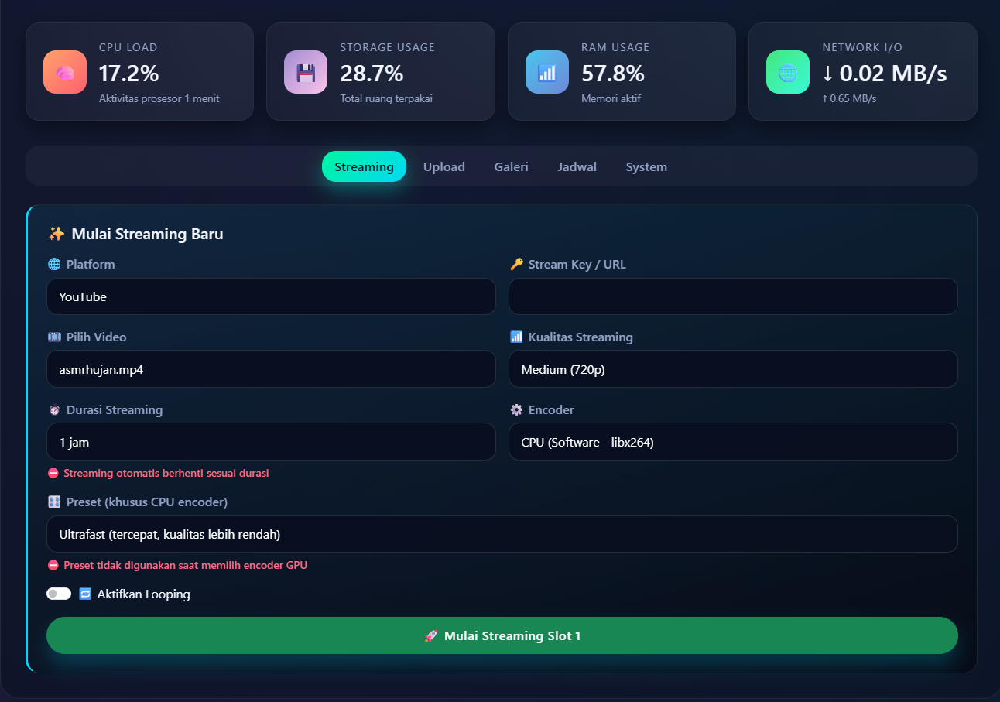
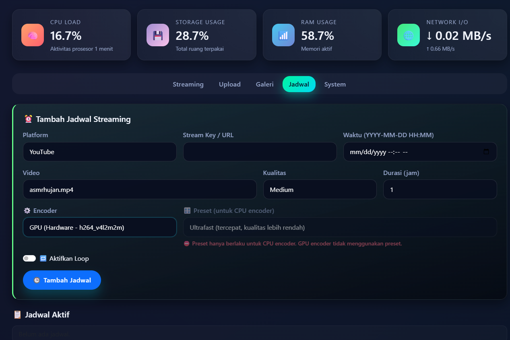
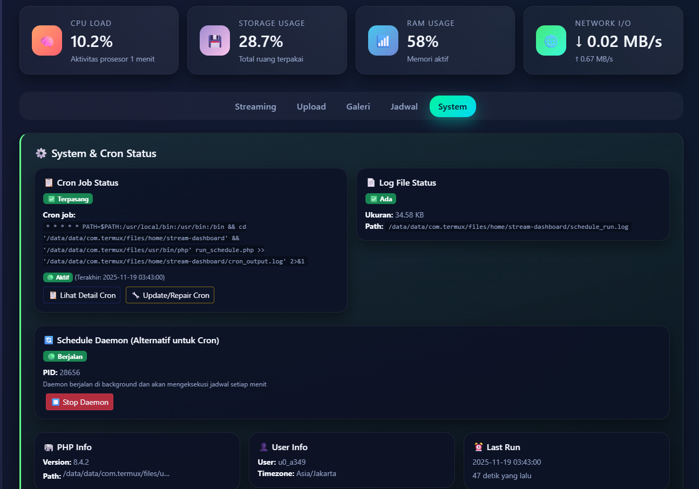

# 🎥 Stream Dashboard

> Dashboard web berbasis PHP untuk mengelola streaming video live ke berbagai platform (YouTube, Facebook Live, Twitch, dan Custom RTMP) menggunakan FFmpeg. Aplikasi ini dirancang untuk berjalan di Termux (Android) atau Linux dengan kontrol penuh melalui antarmuka web yang modern dan responsif.

  

---

## 📸 Screenshot

### Halaman Streaming


### Halaman Jadwal


### Halaman System & Monitoring


---

## 🚀 Quick Start

### Instalasi Cepat (3 Langkah)

```bash
# 1. Clone repository
git clone https://github.com/latifangren/stream-dashboard.git stream-dashboard
cd stream-dashboard

# 2. Jalankan script instalasi
chmod +x install.sh
./install.sh

# 3. Buat user pertama
# Via browser: http://[IP]:3100/add_user.php
```

**Platform yang Didukung:**
- ✅ Termux (Android) - Minimum Android 7.0+
- ✅ Alpine Linux / postmarketOS
- ✅ Debian / Ubuntu VPS

**Port Default:** `3100`

**Lokasi Instalasi:**
- Termux/Alpine: `~/stream-dashboard`
- VPS: `/opt/stream-dashboard` (dengan systemd service)

---

## ✨ Fitur Utama

### 🎬 Streaming Multi-Platform
- **YouTube Live** | **Facebook Live** | **Twitch** | **Custom RTMP**
- Dual slot streaming (hingga 2 streaming bersamaan)
- Video looping tanpa batas
- Kualitas: Low (480p), Medium (720p), High (1080p)
- Hardware/Software encoding (CPU & GPU support)
- Durasi streaming otomatis (1-24 jam)

### 📅 Penjadwalan Otomatis
- Auto-start scheduled streams
- Multiple schedules support
- Cron integration & Schedule Daemon
- Setup cron via web interface
- Toleransi waktu: -5 menit sampai +1 menit

### 📊 Monitoring Real-time
- CPU, RAM, Disk, dan Network I/O monitoring
- Update real-time setiap 10 detik

### 🎞️ Manajemen Video
- Upload, rename, dan delete video
- Galeri video dengan preview

### 👥 Multi-User System
- Sistem multi-user dengan isolasi data
- Secure authentication dengan password hash

---

## 🔧 Persyaratan Sistem

### Software
- **PHP 7.4+** (ekstensi: `posix`, `json`, `session`)
- **FFmpeg** (dengan dukungan H.264 encoding)
- **Web Server** (Apache/Nginx atau PHP built-in server)
- **Cron** atau **Schedule Daemon** (opsional, untuk auto-schedule)

### Hardware (Rekomendasi)
- **RAM**: Minimum 2GB (4GB+ untuk dual streaming)
- **Storage**: Tergantung ukuran video

### Encoder Support
- **CPU**: `libx264` (software encoding)
- **GPU/Hardware**: 
  - `h264_mediacodec` (Android MediaCodec)
  - `h264_vulkan`, `h264_nvenc`, `h264_qsv`
  - `h264_v4l2m2m`, `h264_omx`, `h264_videotoolbox`

### Perangkat yang Telah Diuji
- ✅ Google Pixel 5 A15 (GPU Encoding: ✅) - Snapdragon 765G
- ✅ SONY XZ2C A10 (GPU Encoding: ✅) - Snapdragon 845
- ⚠️ Xiaomi Redmi Note 5 (GPU Encoding: ❌ kernel issue) - Snapdragon 636

---

## 📦 Instalasi

### Metode Otomatis (Disarankan)

Script instalasi akan otomatis:
- Mendeteksi platform (Termux/Alpine/VPS)
- Menginstall dependencies
- Setup web server
- Membuat folder dan permission yang diperlukan

```bash
chmod +x install.sh
./install.sh
```

### Akses Dashboard

**VPS (Debian/Ubuntu):**
```bash
# Service otomatis berjalan
# Akses: http://[IP_SERVER]:3100
```

**Termux/Alpine:**
```bash
cd ~/stream-dashboard
php -S 0.0.0.0:3100
# Akses: http://localhost:3100 atau http://[IP]:3100
```

### Setup Auto-Schedule

**Metode 1: Via Web Interface (Disarankan)**
1. Login ke dashboard → Tab **Schedule**
2. Scroll ke **System & Cron Status**
3. Klik **⚙️ Setup Cron Otomatis** atau **🔧 Update/Repair Cron**

**Metode 2: Schedule Daemon (Alternatif)**
1. Login ke dashboard → Tab **Schedule**
2. Klik **▶️ Start Daemon** di bagian Schedule Daemon

**Metode 3: Manual (Terminal)**
```bash
crontab -e
# Tambahkan (sesuaikan path):
* * * * * cd '/path/to/stream-dashboard' && php run_schedule.php >> cron_output.log 2>&1
```

---

## ⚙️ Konfigurasi

### Platform Streaming

| Platform | Cara Mendapatkan Stream Key |
|----------|------------------------------|
| **YouTube Live** | [YouTube Studio](https://studio.youtube.com) → Go Live → Stream |
| **Facebook Live** | [Facebook Live](https://www.facebook.com/live/create) → Settings |
| **Twitch** | [Twitch Dashboard](https://dashboard.twitch.tv/settings/stream) → Primary Stream Key |
| **Custom RTMP** | Masukkan URL lengkap: `rtmp://server.com:1935/live/stream_key` |

### Encoder & Kualitas

**CPU Encoder (libx264):**
- Preset: `ultrafast` (tercepat) → `veryslow` (terbaik)
- Disarankan: `veryfast` (seimbang)

**GPU Encoder:**
- Otomatis terdeteksi
- Tidak menggunakan preset (hardware preset sendiri)

**Kualitas Streaming:**
- **Low (480p)**: 1000k bitrate (~1 Mbps)
- **Medium (720p)**: 2000k bitrate (~2 Mbps) ⭐ Disarankan
- **High (1080p)**: 6000k bitrate (~6 Mbps)

---

## 📖 Cara Penggunaan

### 1. Login & Setup User
Akses `http://[IP]:3100/add_user.php` untuk membuat user pertama.

### 2. Upload Video
Tab **Upload** → Pilih file MP4 → **Mulai Upload**

### 3. Mulai Streaming
Tab **Streaming** → Isi form:
- Platform, Stream Key/URL, Video, Kualitas
- Durasi (1-24 jam), Encoder, Preset, Looping
- Klik **Mulai Streaming**

### 4. Jadwalkan Streaming
Tab **Jadwal** → Isi form → **Tambah Jadwal** → Setup auto-start (cron/daemon)

### 5. Monitoring
Dashboard menampilkan statistik real-time: CPU, RAM, Disk, Network I/O

---

## 🔧 Troubleshooting

### Streaming Tidak Berjalan
```bash
# Cek FFmpeg
ffmpeg -version

# Cek log
cat users/[username]/log-1.txt
cat users/[username]/debug.txt
```

### Encoder GPU Tidak Terdeteksi
```bash
# Cek encoder tersedia
ffmpeg -hide_banner -encoders | grep h264

# Fallback otomatis ke CPU jika GPU tidak tersedia
```

### Scheduled Stream Tidak Berjalan
1. **Via Web**: Tab Schedule → System & Cron Status → Cek status → Repair/Start
2. **Via Terminal**: 
   ```bash
   crontab -l  # Cek cron job
   php run_schedule.php  # Test manual
   tail -f schedule_run.log  # Cek log
   ```

### Upload Gagal
**Cek & Update PHP Config (Termux):**
```bash
# Cek limit
php -r "echo 'upload_max_filesize: '.ini_get('upload_max_filesize').PHP_EOL;"

# Edit php.ini
cp /data/data/com.termux/files/usr/etc/php/php.ini-development \
   /data/data/com.termux/files/usr/etc/php/php.ini

# Tambahkan/ubah:
upload_max_filesize = 2G
post_max_size = 2G
memory_limit = 1G
max_execution_time = 300
```

### Dashboard Tidak Bisa Diakses

**VPS:**
```bash
sudo systemctl status stream-dashboard
sudo systemctl start stream-dashboard
sudo ufw allow 3100/tcp
```

**Termux:**
```bash
cd ~/stream-dashboard
php -S 0.0.0.0:3100
# Pastikan terminal tetap terbuka atau gunakan screen/tmux
```

### Network I/O Tidak Terbaca
```bash
# Install iproute2 (Termux)
pkg install iproute2

# Cek manual
ip -s link
```

> **Catatan**: Di beberapa ROM Android tertentu, akses network stats memerlukan root.

---

## 📁 Struktur Proyek

```
stream-dashboard/
├── index.php              # Dashboard utama
├── login.php, logout.php, add_user.php
├── stream.php, stop.php  # Handler streaming
├── upload.php, delete_video.php, rename_video.php
├── schedule.php, run_schedule.php
├── schedule_daemon.php, daemon_control.php
├── setup_cron.php, cron_status.php, check_cron.php
├── test_run_schedule.php, stats.php
├── install.sh, uninstall.sh
├── assets/theme.css
├── users/                 # Data user (auto-created)
│   └── [username]/
│       ├── videos/        # Video files
│       ├── schedule.json  # Schedule data
│       ├── status-*.json  # Streaming status
│       └── log-*.txt     # Log files
└── README.md
```

---

## 📝 Catatan Penting

### Keamanan
- ⚠️ Jangan expose dashboard ke internet tanpa autentikasi kuat
- 🔒 Gunakan HTTPS untuk production
- 🔑 Ganti password default setelah instalasi
- 🛡️ Pertimbangkan menggunakan firewall

### Performance
- Dual streaming membutuhkan resource cukup (4GB+ RAM disarankan)
- Monitor CPU dan RAM usage
- Gunakan hardware encoder jika tersedia

### Storage & Network
- Video upload memakan storage - monitor disk usage
- Streaming membutuhkan bandwidth stabil:
  - Low: ~1 Mbps | Medium: ~2 Mbps | High: ~6 Mbps

---

## 📄 Lisensi

Lihat file [LICENSE](LICENSE) untuk informasi lisensi.

## 🤝 Kontribusi

Kontribusi sangat diterima! Silakan buat issue atau pull request.

## 📧 Support

Jika mengalami masalah, silakan buat issue di repository.

---

**Dibuat dengan ❤️ untuk streaming yang lebih mudah**
